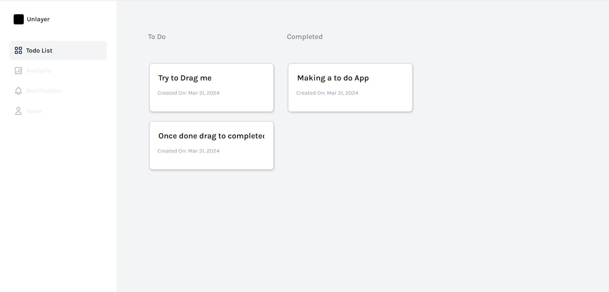

# To Do list app for UnLayer

## Clone the Repository

Clone this repository to your local machine:

```bash
git clone https://github.com/NomanQureshi1997/todo-app.git
```

## Installation With docker

```bash
docker-compose up
```

## Installation Without docker

### Install Node.js

Before proceeding, make sure you have Node.js installed on your system. You can download and install the latest version of Node.js from the official Node.js website.

### Install Required Packages

```bash
npm i
```

### Serving

```bash
npm run dev
```

---

## UI reference

https://www.figma.com/file/EqcZKJ6EZn5rRFHHjOw6tm/Clean-Kanban-Todo-(Community)?type=design&node-id=10-90&mode=design&t=aIRXluO3JqGaqHoB-4

## Demo Video

You will find a demo video in public folder

## Screen shots



## Question: Describe the concept of data binding in Vue.js and its advantages.

It's simple, The magic happening in this app is all due to data binding, I am able to save input field value without making any action. If we go towards the defination it is as follow:

```
Data binding in Vue. js establishes a connection between the application's data and the DOM. It allows you to reflect changes in the data directly in the user interface and vice versa.
```

### Advantages:

1. Efficient Updates
2. Reusable Components
3. Reduces user actions & page refresh.
4. Increased Productivity (No need to define functions to saves values)
5. Declarative Syntax etc

## For React task please go through readme file in /react_server directory
