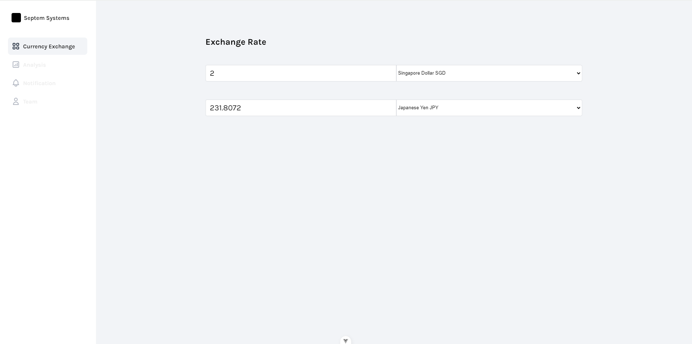

# Currency Exchange API

## Clone the Repository

Clone this repository to your local machine:

```bash
git clone https://github.com/NomanQureshi1997/septem-systems.git
```

## Installation With docker

```bash
docker-compose up
```

## Installation Without docker

### Install Node.js

Before proceeding, make sure you have Node.js installed on your system. You can download and install the latest version of Node.js from the official Node.js website.

### Install Required Packages

```bash
npm i
```

### Serving

```bash
npm run dev
```

---

## UI reference

https://www.figma.com/file/EqcZKJ6EZn5rRFHHjOw6tm/Clean-Kanban-Todo-(Community)?type=design&node-id=10-90&mode=design&t=aIRXluO3JqGaqHoB-4

## Screen shots




## Description
This app simpliy triggers an API of https://app.exchangerate-api.com upon the user selection.