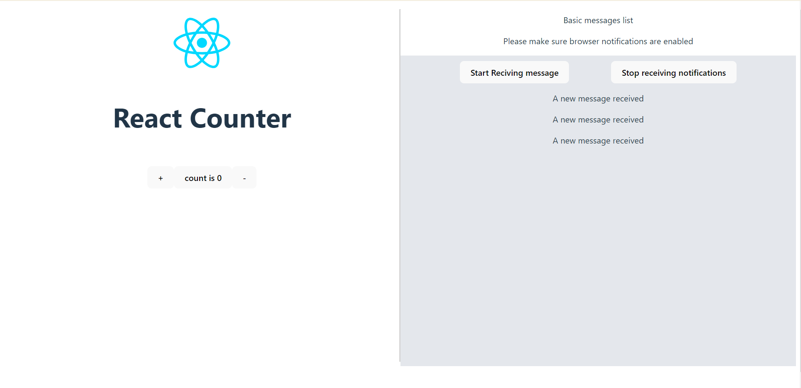

# To Do list app for UnLayer

## Clone the Repository

Clone this repository to your local machine:

```bash
git clone https://github.com/NomanQureshi1997/todo-app.git
```

### Install Node.js

Before proceeding, make sure you have Node.js installed on your system. You can download and install the latest version of Node.js from the official Node.js website.

### Command

```bash
cd react_server
```

### Install Required Packages

```bash
npm i
```

### Serving

```bash
npm run dev
```

---

## About this app

As per requirements, the application needs to implement two basic features:

Counter:
The counter feature has a simple logic where users can add positive numbers. It provides a functionality to increment the counter value.

Message Notification for Chat App:
The message notification feature includes a "start" button to test notifications. In the background, there's a set interval that pushes a notification every 5 seconds. Users will receive these notifications with a bell icon regardless of which tab they are currently on.

These features provide basic functionality to the application, allowing users to interact with the counter and receive notifications for new chat messages.

## Demo Video

You will find a demo video in public folder

## Screen shots



## Question: Explain the concept of state management in React and different ways to manage complex application state.

State management is a crucial concept in frameworks like Vue.js, React, Angular, and others, enabling efficient handling of data within components. It represents a set of information that is manipulated or updated. In complex applications, such as dashboards with multiple components, each containing intricate state, managing this complexity is essential. To address this, frameworks offer various approaches:

1. Local Component State
2. Prop Drilling
3. Context API
4. State management libraries like Redux
5. GraphQL
